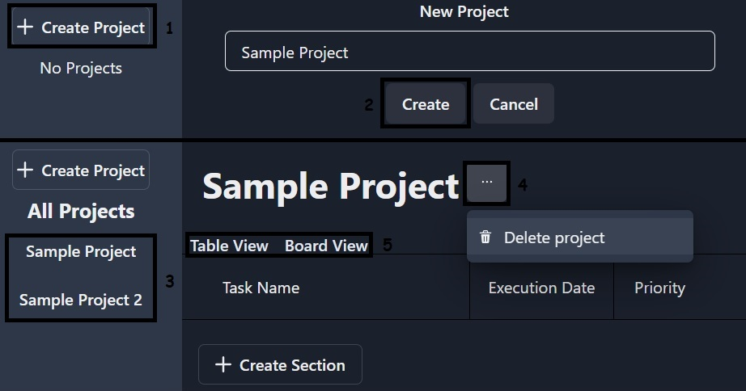
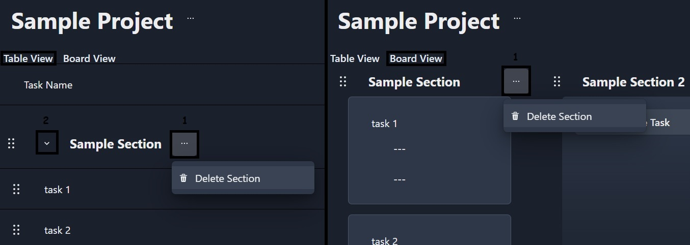
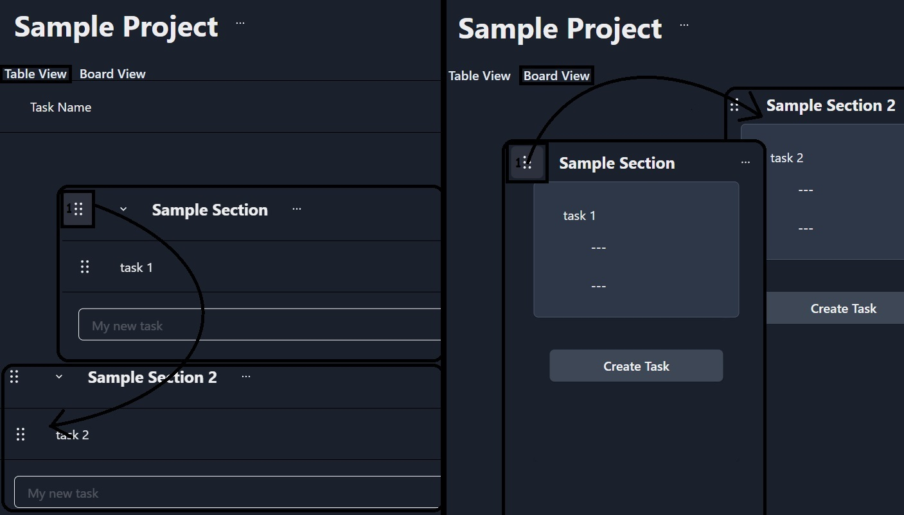
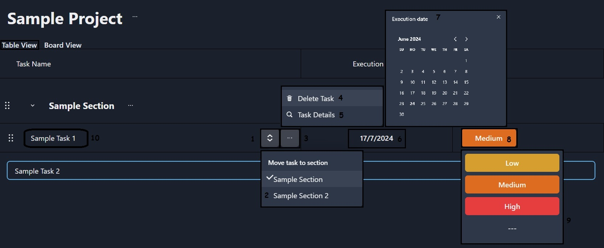
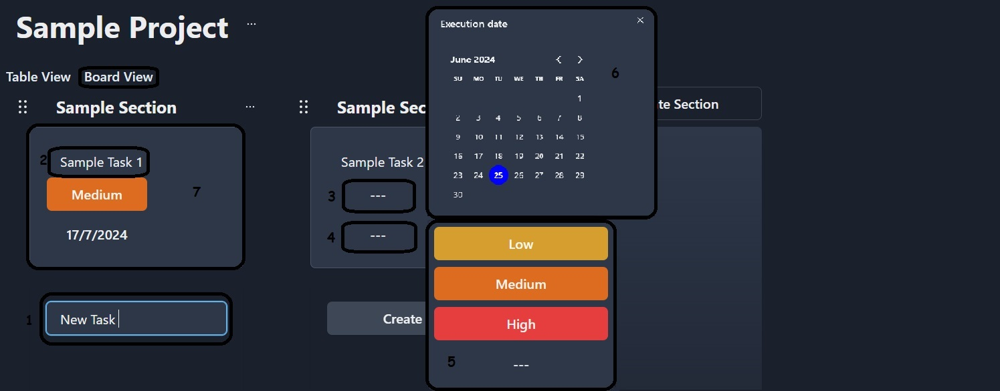
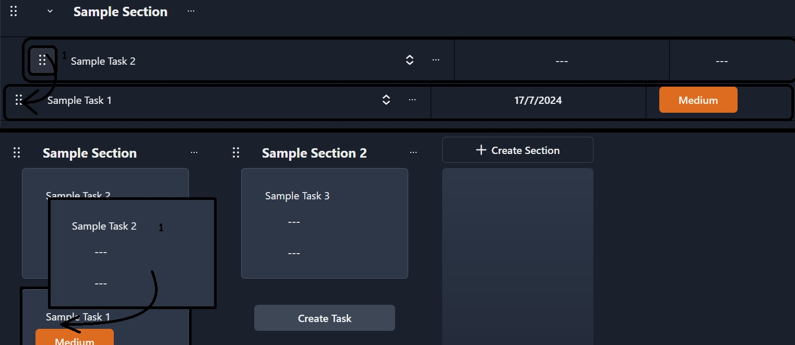
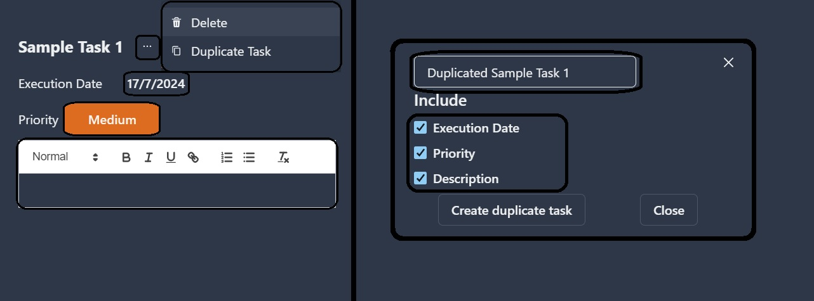

# Atlas - project management app

An application that helps you manage projects

## Table of contents

- [Technologies](#technologies)
- [How to use](#how-to-use)
- [Inspiration](#inspiration)

## Technologies

Project is created with:

- Lorem version: 12.3
- Ipsum version: 2.33
- Ament library version: 999

## How to use

- [Project](#project)
- [Section](#section)
- [Task](#task)

### Project

If you want create new project you have to click "Create Project" button (1) on left side. Next step enter the project name and press "create" button (2) or press enter. The application will automatically redirect you to the new project. If u have more than one project you can switch between them. Just select project in menu on left side (3). To delete project click menu button (4) near project name and press "delete project" button. You can use two views. To change view, you have to click on
chosen view (5)

### Section

Click on "Create Section" button(1) and enter section name(2).

To delete section press button(1) and click "Delete Section". In list view you can hide/show tasks list. To do it press button(2)

To change the order of sections, grab the button (1) and move the sections to the desired place and then drop them.

### Task

## Inspiration
