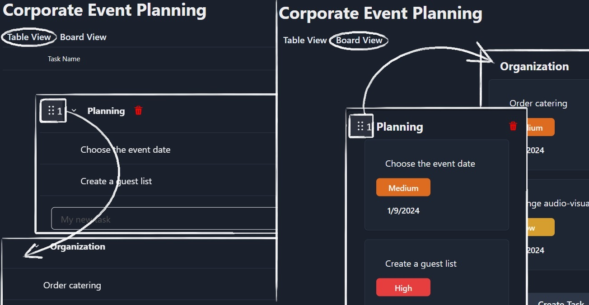

# Atlas - project management app

An application that helps you manage projects.

## Table of contents

- [Inspiration](#inspiration)
- [Technologies](#technologies)
- [How to use](#how-to-use)

## Inspiration

While developing this application, I drew inspiration from Asana, a popular project management tool. My goal was to create an application that offers similar capabilities with my own approach, tailored specifically for individual users.

Project Management: Like Asana, my application allows users to create projects that can be divided into sections.
Sections and Tasks: Users can add tasks to specific sections and change their order using the drag and drop functionality. Tasks can have assigned dates, priorities, and comments.
Views: The application provides two views for projects: a table view and a board view, allowing users to choose the most suitable way to manage their tasks.
By drawing inspiration from Asana, I wanted to create a tool that is helpful for individual users, simplifying the process of managing their projects and tasks.

## Technologies

Project is created with:

-  react-query: 5.0,
-  chakra-ui: 2.8,
-  dnd-kit/core: 6.1,
-  react-quill: 2.0,
-  zod: 3.22,

## How to use

- [Project](#project)
- [Section](#section)
- [Task](#task)
- [Task details](#task-details)

### Project

If you want to create a new project, you have to click the "Create Project" button (1) on the left side.
Next, enter the project name and press the "Create" button (2) or press Enter.
The application will automatically redirect you to the new project.
If you have more than one project, you can switch between them by selecting the project in the menu on the left side (3).
To delete a project, click the menu button (5) near the project name and press the "Delete Project" button.
You can use two views. To change the view, you have to click on the chosen view (4).

### Section

To delete a section, press the button (1) and click 'Delete Section.' In list view, you can hide/show the tasks list by pressing button (2).

To change the order of sections, grab the button (1), move the section to the desired place, and then drop it.

### Task

Click on the input (1), enter the task name, and press Enter. To change an existing task name, just click on the task name (2) and edit it.
To move a task to another section, click button (3), choose the section where the task should be sent (4), and click it.
After clicking the button (5), you can open task details.
To set the execution date, press button (6). In the execution date window (7), choose a date and click it.
To set the priority, click button (8) and choose the priority in the priority menu (9).

Click on the input (1), enter the task name, and press Enter. To delete a task, press the button (2), to change an existing task name, just click on the task name (3) and edit it.
To set the execution date, press button (4). In the execution date window (5), choose a date and click it.
To set the priority, click button (6) and choose the priority in the priority menu (7). Click on the task card (8) to open task details.

To change the order of tasks, grab the button (1), move it to the desired place, and then drop it. You can also move a task to another section.

### Task Details

After clicking button (1), you can duplicate the task or delete the task (3).
To set the execution date, press button (4), and to set the priority, press button (5).
If you want to include a description, use the text editor (6). You don't need to press anything to save the description, just enter it.
In the task duplicate window, the first thing you can do is change the task name. To do this, press the input (7) with the suggested name and change it.
In the include part (8), you can choose which properties of the task to duplicate. When you are done, press "Create duplicate task" (9).
